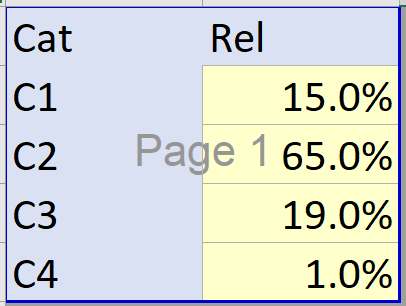
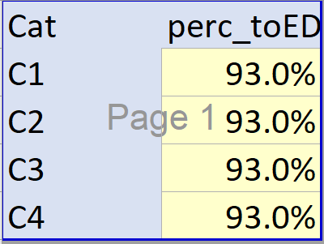
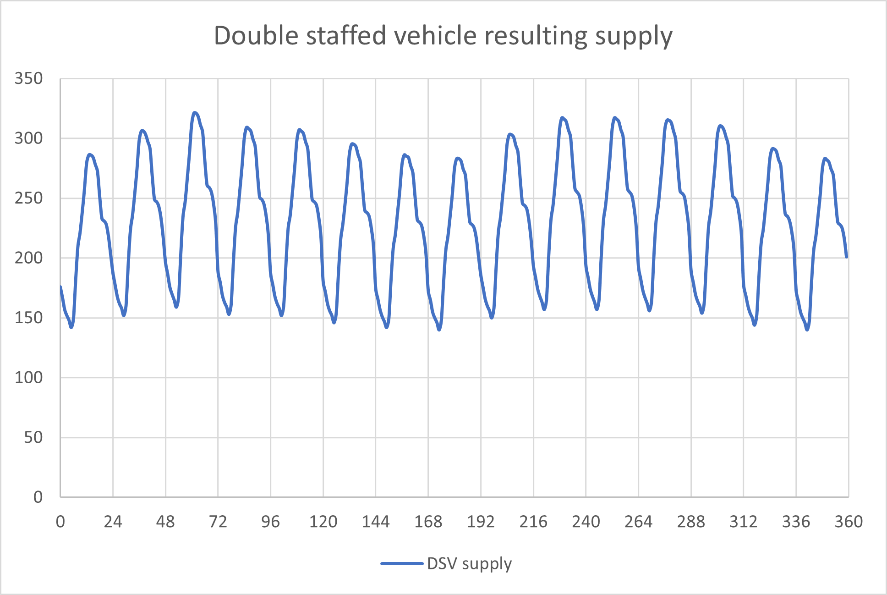

> **Warning**
> IN CONSTRUCTION.

`inputs.R` is the main script for loading in Input parameter files. This file would typically not be updated, with all user updates being done in the Input parameter files themselves and `config.R`.

The resulting Inputs for demand, supply, and timings were taken from the identified data sources.
Below some examples are given (though other options are possible).

For a more detailed User guide on the use of Parameter Input Files, see [User guide - Parameter input files](userguide.md).

## Demand - Hourly Schedule
The demand schedule is made up of a dataframe which covers hourly arrivals for:

- Number of ambulance incidents (calculated from hourly and weekday proportions of actual number of incidents from selected geography in selected time period)
- Number of direct ED walk-in demand (calculated from hourly and weekday proportions of uplifted number of incidents by a factor of 1.736)

Note: other options available, see [User guide - Parameter input files](userguide.md).

## Demand and Flow - Category

When patients are generated as demand in the model, they are assigned a category.
This can be set as either time-variant or time-invariant.

Time-variant:

- Proportion of Category1 ambulances (calculated from actual numbers of cat 1 ambulance calls multiplied by hourly profiles)
- Proportion of Category2 ambulances (calculated from actual numbers of cat 2-4 ambulance calls multiplied by hourly profiles and category proportion)
- Proportion of Category3 ambulances (calculated from actual numbers of cat 2-4 ambulance calls multiplied by hourly profiles and category proportion)
- Proportion of Category4 ambulances (calculated from actual numbers of cat 2-4 ambulance calls multiplied by hourly profiles and category proportion)

Time-invariant:

## Demand and Flow - Model of Care

Patients are assigned a care model depending on their category.

## Demand and Flow - Category

Patients needing conveyance are assigned a conveyance destination (ED or non-ED).

## Demand and Flow - ED Acuity

Patients are allocated an acuity based on their route to ED and category

## Job Cycle Time
The inputs for the Job Cycle Time Components can be chosen as either Quantile-based or Stylistic parametrisation-based.

The relevant components are:

- Travel to scene
- Time at scene
- Travel to site
- Unavoidable pre-handover
- Time to clear
- _(pre-handover and time to allocate are emerging queuing model characteristics, not inputs)_

Fig. Example input "Time at Scene" JCT component (Quantile-based). For ‘See and Treat’ incidents, divided by categories.

Fig. Example input "Time at Scene" JCT component (Stylistic-based). For ‘See and Convey’ incidents, divided by categories.

## Supply- Hourly Schedule
The supply schedule is made up of a dataframe which covers hourly resources available for:

- Number of double staffed vehicles (DSV/DSA) (calculated from hourly and weekday proportions of actual number of ambulances available from selected geography in selected time period)
- Relative hourly ED supply (calculated from hourly, weekday and week-on-week relative proportions)

Note: other options available, see [User guide - Parameter input files](userguide.md).

