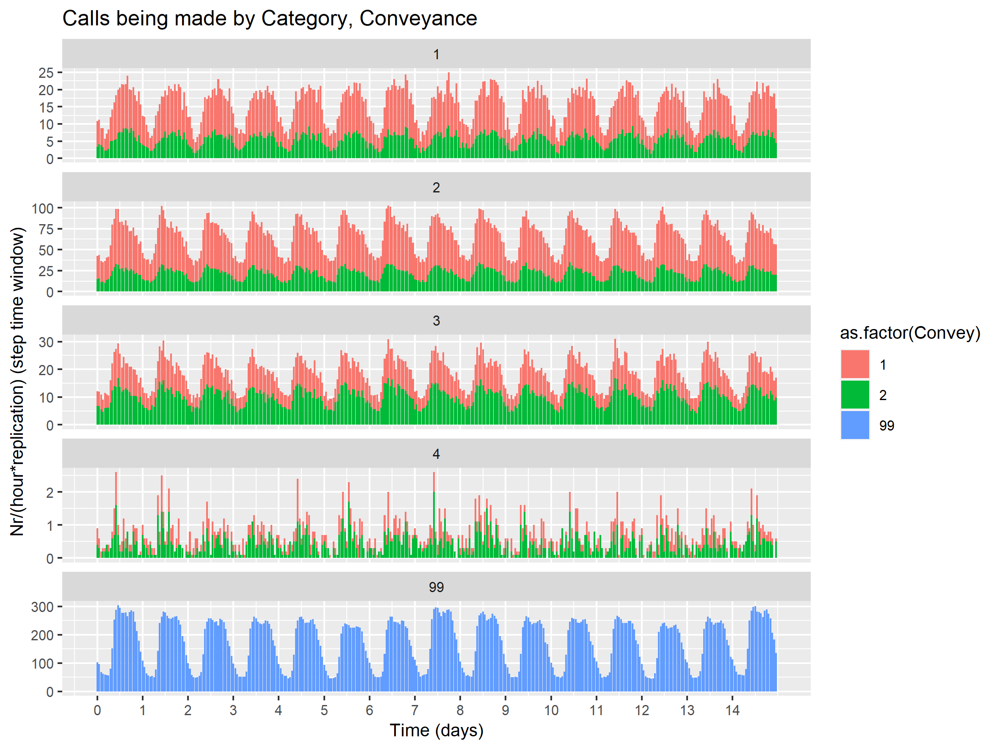
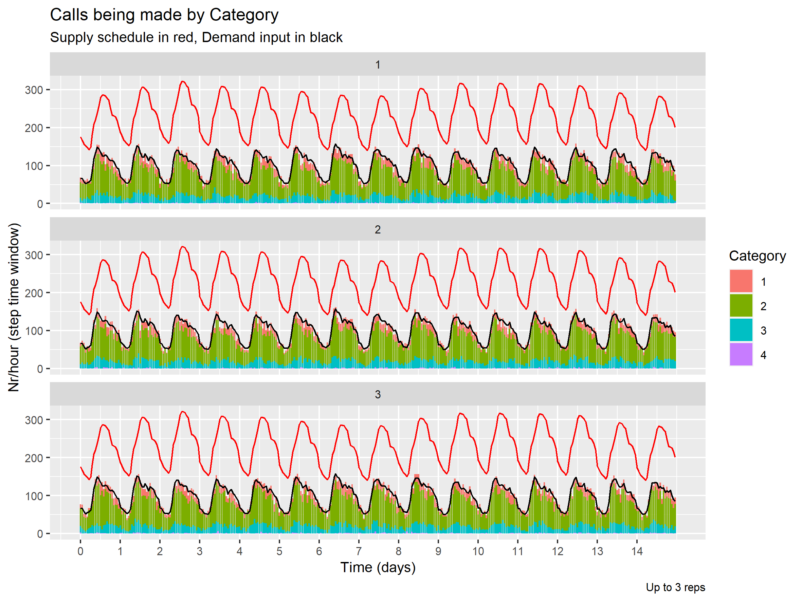

> **Note**
> Internal NHSE documentation for the results of Phase 1 of the work (March-April 2023) and Phase 2 of the work (April-May 2023) not made public.
> Outputs from the Toy / Fake scenarios shown below to exemplify outputs.

The "foundation" outputs of the model are the Log of Arrivals (log_arrivals.xlsx) and the Log of Attributes (log_attributes_w.xlsx).

These will be saved if `flag_savedata_fulllogs <- TRUE` in `config.R` (a reason to set this to False may be avoiding to save large files unnecessarily).

All relevant graphical visualisations and summary metrics can likely be created from these.

The script `post-processing.R` already has specified and produces a range of outputs based on those logs, both in table and visual format. These are shown below.

Alternatively, the end-user is free to do their own post-processing with the logs given.

## Example outputs from Fake_Data_2

Example outcomes from `parameters/Fake_Data_2/` scenario , with `n_AEbays <- 1500`, `T_AE <- 6.5`, `flag_LoS_file <- FALSE`, `dn_AEsupplyshock <- 0`

### Demand

**Figure** Demand per category and conveyance (colour-coded ; 1 - see and convey; 2 - see and treat; 3 - hear and treat; 99 - direct ED)

### Demand and supply

**Figure** Incident demand per category (colour-coded ; categories 1-4). 3 replications shown. Direct ED demand excluded. Black trace - input demand. Red-trace - input DSV supply

### Resource utilisation KPIs

#### Instantaneous utilisation, capacity and queue traces

**Figure** Instantaneous resource usage for respectively ambulance and A&E bay. Dashed blue - server capacity ; Solid blue traces - server use ; Solid red traces - queues . Multiple traces due to n=10 rpelications.

#### Utilisation KPIs - batch, overall simulation time

**Figure** Utilisation and queue for A&E bay and ambulance. Average and standard deviation.

### Response time KPIs

**Figure** Mean response time KPIs per category and per simulation time-steps. Boxplots showing inter-replication variation. Dashed line is dummy, can be used to benchmark.

**Table** Response time KPIs (mean, median, 90th) averaged across simulation time and replications (mean, standard deviation)

{{ read_excel('./assets/Fake_Scenario_2/KPIbatch_overall_RTcat.xlsx', engine='openpyxl') }}

### Handover KPIs

**Figure** Handover KPIs per simulation time-steps. Boxplots showing inter-replication variation. Dashed line is dummy, can be used to benchmark.

**Table** Handover KPIs averaged across simulation time and replications (mean, standard deviation)

{{ read_excel('./assets/Fake_Scenario_2/KPI_overall_HO.xlsx', engine='openpyxl') }}

### Select Job Cycle Time KPIs

**Table** KPIs 'Time to allocate' , 'Time for pre-handover', 'Total job cycle time', 'Response time', per conveyance. Mean and median.

{{ read_excel('./assets/Fake_Scenario_2/KPI_overall_val_conv.xlsx', engine='openpyxl') }}

### Call queue KPIs

**Figure** Average call queue KPI per simulation time-steps (6 hour window). Boxplots showing inter-replication variation.

### (Hospital) site queue KPIs

**Figure** Average site queue KPI per simulation time-steps (24 hour window). Boxplots showing inter-replication variation.

